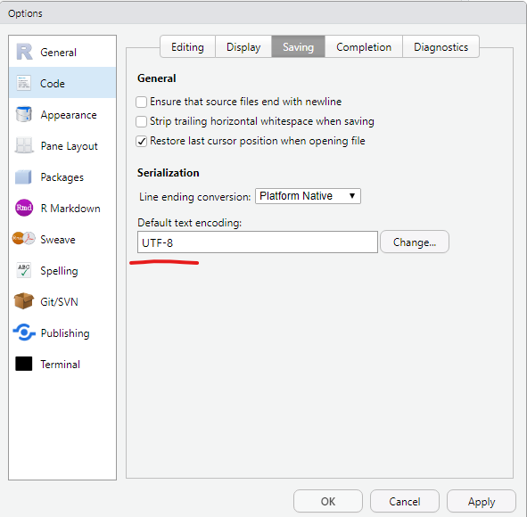

# Los Geht's! {#day1}

## Slides

[hier!](/slides/dataintro19)

## R als Taschenrechner

```{r, eval=FALSE}
# Code coming

```

## Project-based Workflow

Wichtige RStudio-Einstellungen:

```{r echo=FALSE, out.width='40%'}
knitr::include_graphics("img/RS_settings.png")

```

## Packages

### The Tidyverse

```{r}
# install.packages("tidyverse")
library(tidyverse)
```

