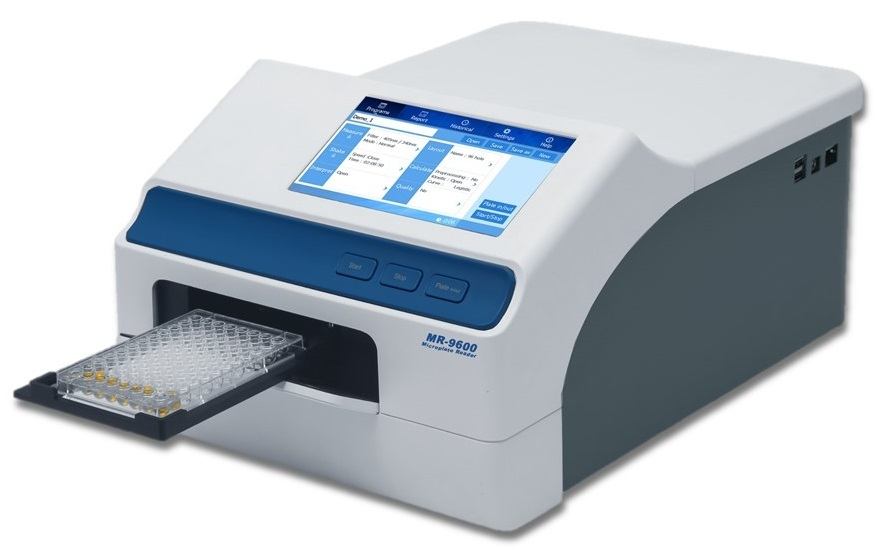

# Tidy Data, Visualisierung und Statistische Größen

```{r, include=FALSE}
knitr::opts_chunk$set(eval = FALSE)
```

## Wiederholung Tag 2

- Was ist das tidyverse?
- Welche Aufgaben erfüllen die wichtigsten `dplyr` Verben?
- Transfer: Was tut die folgende Codezeile?

```r
starwars %>%
  group_by(homeworld) %>% 
  mutate(mass = mass / max(mass, na.rm = TRUE))
```

- Was ist ein P-Value?
- Was ist der Unterschied zwischen
  _binomialverteilten_ und _hypergeometrisch verteilten_ Daten?

```{r}
## demo
# load tidyverse
library(tidyverse)

# dplyr verbs: select, filter, mutate, arrange, summarise; group_by

# Code from above


```

## Visualisierung als Schlüssel zum Verständnis

### Anscombes Quartet

Und eine Notiz zu _Tidy Data_ und dem `tidyr` package.

```{r}
## demo
# load tidyverse

```

```{r}
# show anscombe dataset

```

### Exkurs Tidy Data

Tidy Data bedeutet:

> Every row is an observation, every column is a feature

```{r}
# show image
```

Aber das ist nicht immer leicht.

> "Happy families are all alike; every unhappy family is unhappy in its own way." 
> $-$ Leo Tolstoy

> Tidy datasets are all alike, but every messy dataset is messy in its own way."
> $-$ Hadley Wickham

Im `anscombe` Datensatz versteckt sich ein Feature in
den Spaltennamen! Das `tidyr` Package hilft uns dabei
dieses Feature explizit zu machen.

```{r tidy-data, fig.cap="Following three rules makes a dataset tidy: variables are in columns, observations are in rows, and values are in cells. (Source: R4DS, Hadley Wickham)"}
knitr::include_graphics("img/tidy-1.png")
```


```{r}
# demo
# another example for untidy data e.g. plate reader data
```


```{r plate-reader-img, echo=FALSE, fig.cap="(Quelle: https://www.stellarscientific.com/accuris-smartreader-96-microplate-absorbance-plate-reader/"}

```


```{r}
# Get the data from github-link

# Clean data

# visualize data

# normalize data

# visualize again
```


```{r, eval=FALSE}
# atpase_assay <- readxl::read_xlsx("data/04_ATPase_assay.xlsx", skip = 10,
#                                   .name_repair = "universal")
# clean_data = atpase_assay %>%
#   select(-Content) %>%
#   rename(time = Time..s.) %>%
#   pivot_longer(-time, names_to = "sample", values_to = "absorbtion")
# 
# clean_data %>%
#   ggplot(aes(time, absorbtion, color = sample)) +
#   geom_line()
# 
#   group_by(sample) %>% 
#   mutate(absorbtion = absorbtion / max(absorbtion)) %>% 
```

Das anscombe datenset ist auf eine leicht andere Art "untidy". Worin besteht der
Unterschied?


```{r}
## demo
# tidy anscombe
```


```{r, eval=FALSE}
# demo 
# 
# anscombe_long <- anscombe %>%
#  pivot_longer(everything(),
#    names_to = c(".value", "set"),
#    names_pattern = "(.)(.)"
#  )
```

Jetzt spielt unser Datenset gut mit dem restlichen Tidyverse,
insbesondere ggplot2, zusammen.

```{r}
anscombe_long %>% 
  ggplot(aes(x, y)) +
  geom_point() +
  facet_wrap(~set)
```

Anscombes Quartett ist besonders da:

Gleicher Mittelwert, gleiche Standardabweichung

```{r}
anscombe_long %>% 
  group_by(set) %>% 
  summarise(m_x = mean(x),
            m_y = mean(y),
            sd_x = sd(x)) 
```

Aber was ist noch gleich eine Standardabweichung?


```{r}
# summarise the values with
# mean, SD, SEM
```

```{r}
# explain mean, SD, SEM based on random numbers from normal distribution
```

$$sd = \sqrt{\frac{\sum_{i=0}^{n}{(x_i-\bar x)^2}}{(n-1)} }$$

Warum n-1?

Standard Error of the Mean (SEM oder SE)

$$SEM=SD / \sqrt{n}$$

```{r}
normal <- rnorm(1000, mean = 0, sd = 1)

hist(normal, breaks = 40)
abline(v =  1, col = "red")
abline(v = -1, col = "red")
abline(v =  1 * 2, col = "red")
abline(v = -1 * 2, col = "red")
abline(v =  1 * 3, col = "red")
abline(v = -1 * 3, col = "red")

qqnorm(normal)
qqline(normal, col = "red")

sd(normal)
sd(normal) / sqrt(length(normal))
mean(normal)
qt(0.05/2, 10)

# show with smaller numbers

```


### The Datasaurus Dozen

Das Forschungspaper findet ihr [hier](https://www.autodeskresearch.com/publications/samestats)
[@matejka2017a].

```{r}
# install.packages("datasauRus")
# dinos <- datasauRus::datasaurus_dozen
```


```{r}
# clean datausauRus::box_plots data

# make and explain boxplots
```


```{r}
df <- datasauRus::box_plots %>% 
  pivot_longer(everything(), names_to = "set")
```

```{r}
df %>% 
    ggplot(aes(set, value)) +
    geom_boxplot()
```

```{r}
# summarise data by set with SD, SEM, mean
```


```{r}
df_summmary <- df %>%
  group_by(set) %>% 
  summarise(SD   =  sd(value),
            SEM  = SD/sqrt(n() ),
            value = mean(value) )
```

```{r}
# create barplot with errorbars, SD or SEM
```


```{r}
df_summmary %>% 
  ggplot(aes(set, value)) +
  geom_col(fill = "darkgreen", color = "black", size = 1.3) +
  geom_errorbar(aes(ymin = value - SD,
                    ymax = value + SD),
                size = 1.2, width = 0.3)
```

```{r}
df_summmary %>% 
  ggplot(aes(set, value)) +
  geom_col(fill = "darkgreen", color = "black", size = 1.3) +
  geom_errorbar(aes(ymin = value - SEM,
                    ymax = value + SEM),
                size = 1.2, width = 0.3)
```

```{r}
# finally show the point plot and the jitter plot
```


Friends don't let friends make barplots!

```{r}
df %>% 
    ggplot(aes(set, value)) +
    geom_jitter()
```

```{r}
# And make histograms
```


```{r}
# And a density plot
```


## Übung

### Inclusion Bodies

_Disclaimer_: Die Daten stammen aus dem letztjährigen Kurs
und sind echte Daten,
aber ich lüge euch bei der Bedeutung ein
ganz klein wenig an um den biologischen Hintergund
schneller erklären und sie ohne Probleme veröffentlichen
zu können.

```{r}
# Erklärung Inclusion Bodies
```


- If you want to impress me, do all the exercises
  in a Rmarkdown document, add your conclusions and thoughts
  along with the data analysis process and structure it
  with meaningful headlines using `#`.
- Lies die csv-datei unter `data/03_inclusion_bodies.csv`.
- Mache tidy data daraus
- Visualisiere die Daten (mit ggplot2) als
  - Jittered point plot
  - Boxplot
  - Zwei überlagerte Histogramme (Hinweise: Nutze position = "identity"
    damit R die Histogramme nicht stapelt sondern überlagert)
  - Zwei überlagerte Dichte-Plots (HInweis: Nutze den Parameter `alpha`
    um beide sichtbar zu machen)
  - Einen Barplot miz Fehlerbalken, Hinweise:
    - Erstelle zunächst einen Zusammenfassungs-Dataframe
    - Nutze `geom_col`, **nicht** `geom_bar`
  - BONUS: Mach die Plots hübsch! (e.g. colors, title,
    caption)
- (Morgen: Gibt es einen statistisch signifikanten Unterschied zwischen den Gruppen?)


```{r}
knitr::knit_exit()
```


```{r}
inclusion_bodies <- read_csv("data/03_inclusion_bodies.csv")
```


```{r}
inclusion_bodies <- inclusion_bodies %>% 
  pivot_longer(cols = everything(), names_to = "cell_type", values_to = "n_bodies")
```

```{r}
inclusion_bodies %>% 
  ggplot(aes(cell_type, n_bodies)) +
  geom_jitter()
```

```{r}
inclusion_bodies %>% 
  ggplot(aes(cell_type, n_bodies)) +
  geom_boxplot()
```


```{r}
inclusion_bodies %>% 
  ggplot(aes(n_bodies, fill = cell_type)) +
  geom_density(alpha = 0.3)
```


```{r}
inclusion_bodies_summary <- 
  inclusion_bodies %>% 
  group_by(cell_type) %>% 
  summarise(SD = sd(n_bodies),
            SEM = SD/sqrt(n()),
            n_bodies = mean(n_bodies))
```

```{r}
inclusion_bodies_summary %>% 
  ggplot(aes(cell_type, n_bodies)) +
  geom_col() +
  geom_errorbar(aes(
    ymin = n_bodies - SD,
    ymax = n_bodies + SD
  ))
```


```{r}
inclusion_bodies_summary %>% 
  ggplot(aes(cell_type, n_bodies)) +
  geom_col() +
  geom_errorbar(aes(
    ymin = n_bodies - SEM,
    ymax = n_bodies + SEM
  ))
```


```{r}
# dinos %>%
#   group_by(dataset) %>% 
#   summarize(
#     x_mean = mean(x),
#     y_mean = mean(y),
#     x_sd = sd(x),
#     y_sd = sd(x),
#     corr = cor(x,y)
#   )
```


```{r}
# dinos %>% 
#   ggplot(aes(x, y)) +
#   geom_point() +
#   facet_wrap(~dataset) +
#   coord_equal() +
#   theme_bw()
```


